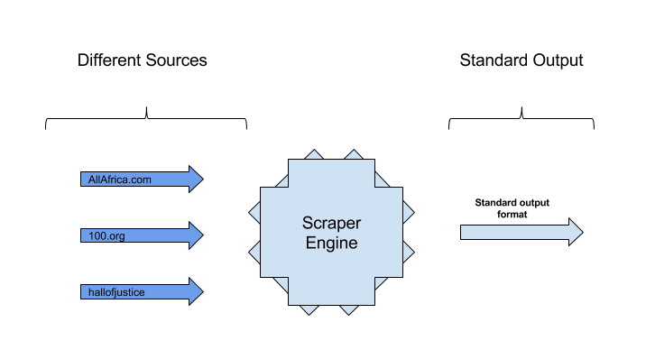

.. CfAfrica-Scrapengine documentation master file, created by
   sphinx-quickstart on Mon Jul 18 11:44:37 2016.
   You can adapt this file completely to your liking, but it should at least
   contain the root `toctree` directive.

CfAfrica: Scrapengine
=====================

``Scrapengine`` loads, executes, and manages web scrapers.

Overview
--------

The objective is to abstract different data sources by standardizing the output format - as illustrated below.

``Scrapengine`` is composed of 2 main components: the engine and the scrapers

**The engine** manages, loads, schedules, and executes the scrapers.

**The scrapers** consume content from different sources (and in different formats). They extract the required components from the data; and output a standard structured CSV

Contents:
========

.. toctree::
   :maxdepth: 2

   scrapers
   usage
   api
   contributing
